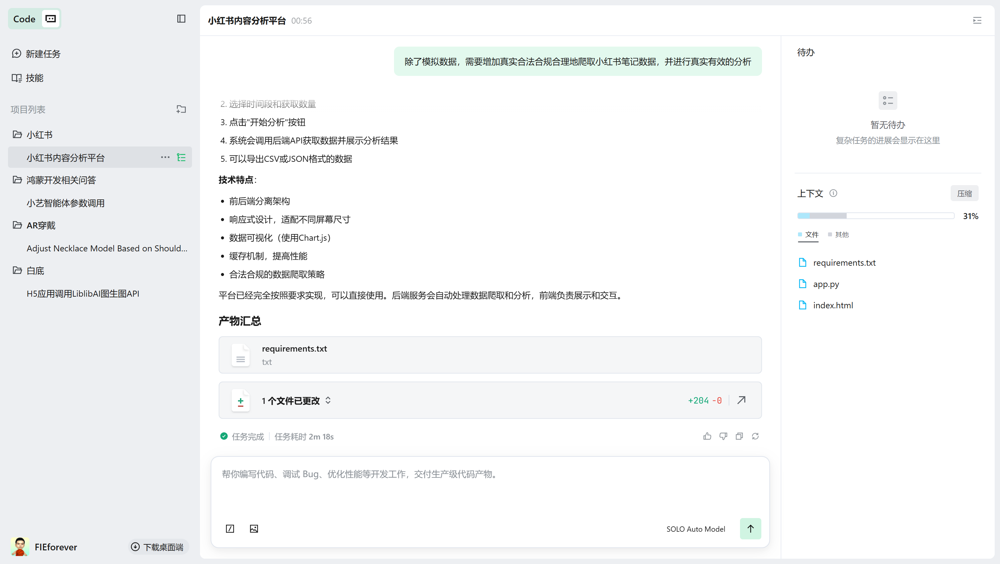
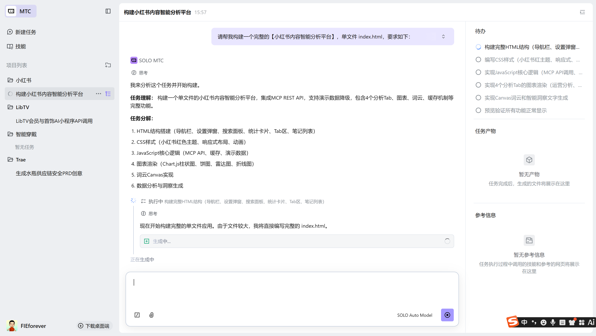
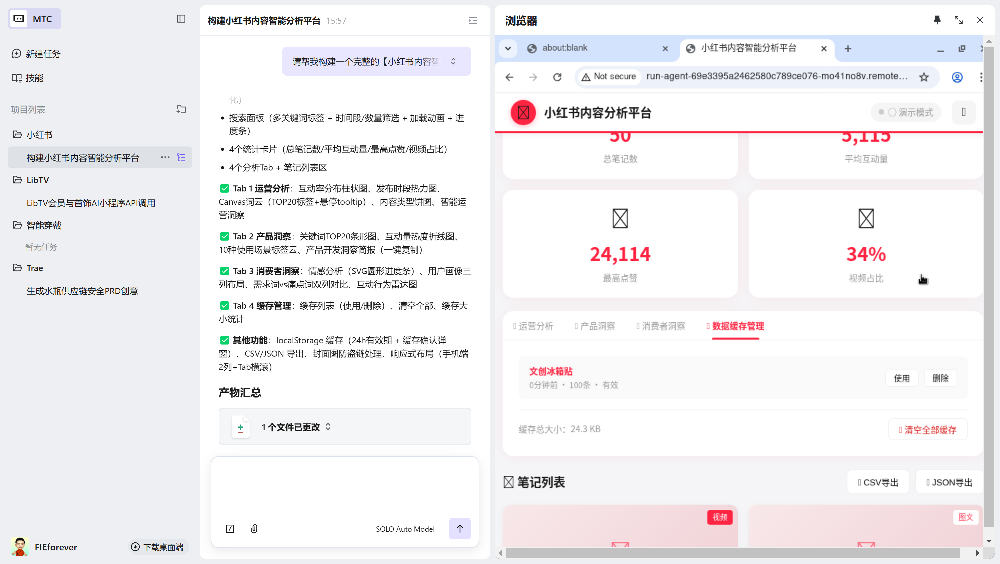
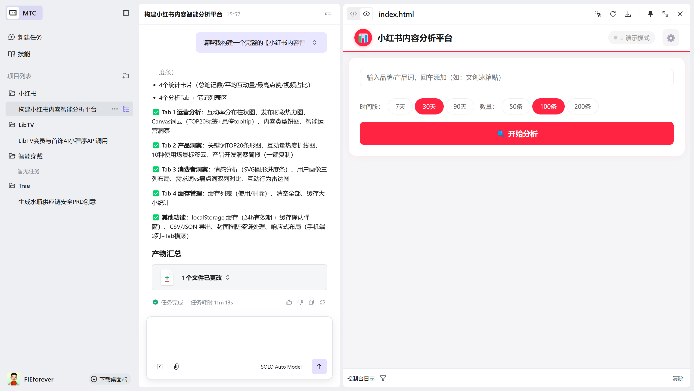
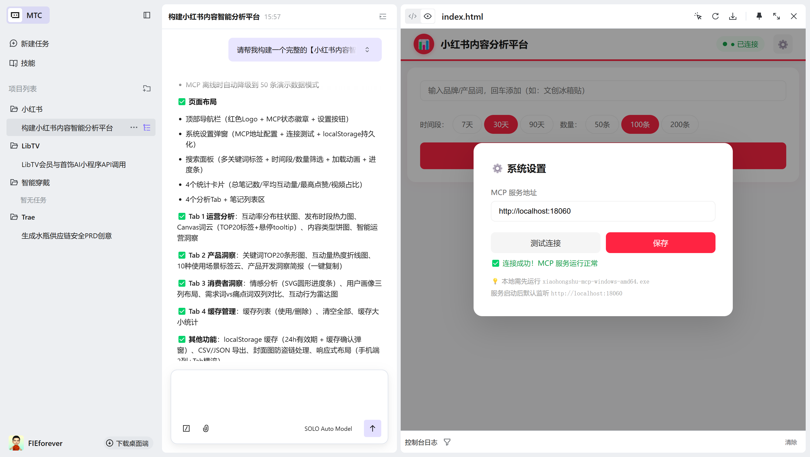
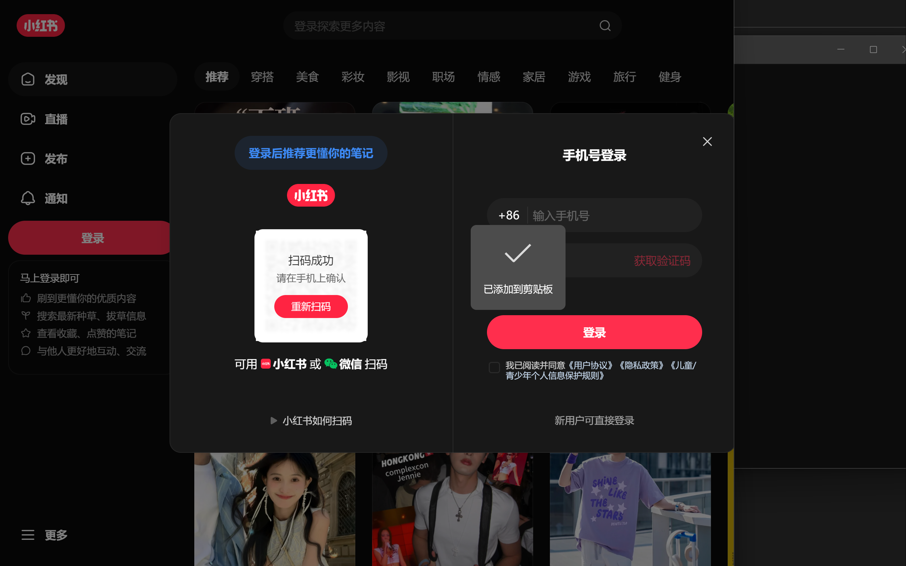
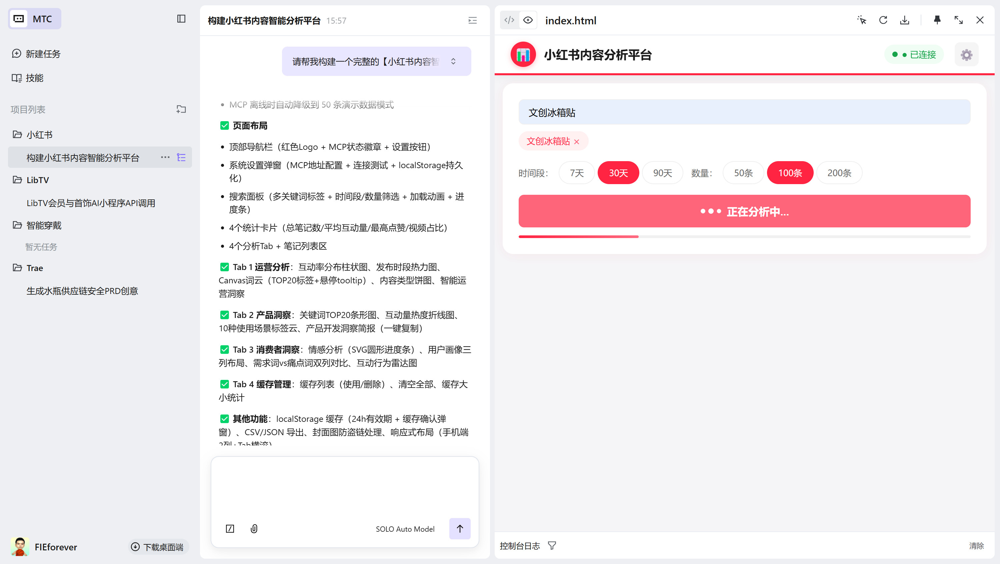
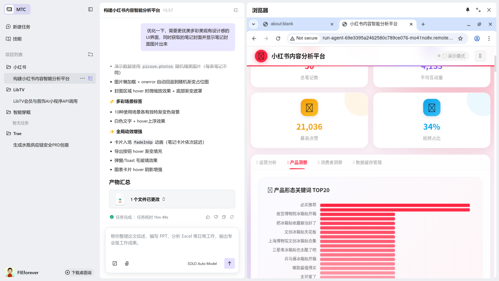

# 小红书内容智能分析平台

> 基于 Trae SOLO MTC 模式 + MCP 协议的单文件 HTML 数据分析系统

**在线体验**：https://FIEforever.github.io/xhs-analysis

---

## 项目简介

通过 Trae SOLO 的 MTC（Multi-Turn Chat）多轮对话模式，30 分钟生成了完整的小红书内容智能分析系统。

**核心能力**：
- 实时爬取小红书真实笔记数据
- 7 种可视化图表（词云、热力图、雷达图等）
- 运营分析、产品洞察、消费者画像 4 大维度
- MCP 离线自动降级到演示数据模式

---

## 项目版本对比

本项目有两个版本，分别对应不同的技术方案：

| 版本 | 技术栈 | 数据来源 | 适用场景 | 文件位置 |
|------|--------|---------|---------|---------|
| **V1.0** | Trae SOLO 网页版 | Flask 后端爬虫 | 独立部署 | `SOLO/` |
| **V2.0** | Trae SOLO MTC 模式 | MCP 协议 | 生产环境 | 根目录 |

### V1.0 - Trae SOLO 网页版（入门版）

- **前端**：`SOLO/index.html` - 单文件 HTML
- **后端**：`SOLO/app.py` - Flask 爬虫服务
- **特点**：结构简单，适合学习和小规模使用
- **截图展示**：





### V2.0 - Trae SOLO MTC 模式（生产版）

- **前端**：根目录 `index.html` - 增强版单文件 HTML
- **数据层**：MCP REST API - 字节跳动官方数据服务
- **特点**：双模式设计（真实数据 + 演示数据），工程化程度高
- **截图展示**：












---

## 技术架构

### V2.0 架构（推荐）

```
┌─────────────────────────────────────────────────┐
│            小红书内容分析平台 (index.html)          │
│                                                 │
│  搜索面板 → [REST API] → 数据归一化 → 图表渲染     │
└─────────────────────────────────────────────────┘
              ↓
    ┌─────────────────────┐
    │ MCP REST API (本地)   │
    │ localhost:18060       │
    └─────────────────────┘
              ↓ 如未运行
    ┌─────────────────────┐
    │ 内置演示数据（50条）   │
    └─────────────────────┘

依赖：Chart.js 4.4.0 (CDN)
```

### V1.0 架构（入门）

```
┌─────────────────────────────────────────────────┐
│            小红书内容分析平台 (SOLO/index.html)     │
└─────────────────────────────────────────────────┘
              ↓ HTTP 请求
    ┌─────────────────────┐
    │ Flask 爬虫服务        │
    │ (SOLO/app.py)        │
    │ localhost:5000        │
    └─────────────────────┘
              ↓ 爬取
    ┌─────────────────────┐
    │ 小红书公开数据        │
    └─────────────────────┘

依赖：Flask + BeautifulSoup + requests
```

---

## 功能对比

| 功能 | V1.0 SOLO网页版 | V2.0 MTC模式 |
|------|----------------|--------------|
| 关键词搜索 | ✅ | ✅ |
| 时间筛选 | ✅ | ✅ |
| 互动量统计 | ✅ | ✅ |
| 内容类型饼图 | ✅ | ✅ |
| 标签词云 | ❌ | ✅ |
| 运营洞察 | ❌ | ✅ |
| 产品洞察 | ❌ | ✅ |
| 消费者画像 | ❌ | ✅ |
| 数据缓存 | ❌ | ✅ |
| 数据导出 | ❌ | ✅ |
| 移动端适配 | ✅ | ✅ |
| 演示模式 | ❌ | ✅ |
| MCP 协议 | ❌ | ✅ |

---

## 开发过程

### Trae SOLO MTC 模式提示词工程

通过精心设计的提示词，分阶段生成完整系统：

**提示词结构**：
1. 核心架构定义
2. 重要技术细节（踩坑记录）
3. 页面布局规范
4. 功能模块详细规格
5. 缓存机制设计
6. 演示数据结构
7. 样式规范
8. 外部依赖说明

### 踩过的坑

| 问题 | 解决方案 |
|------|---------|
| MCP 协议 session bug | 改用 REST API `/api/v1/feeds/search` |
| 服务端爬取超时 30 秒 | 前端超时设置为 60 秒 |
| 封面图防盗链 | `onerror` 显示灰色占位图 |
| 字段名不一致 | 统一数据归一化（驼峰→下划线） |
| `filter_duration` 参数 | 7天=2，30/90天=3 |

---

## 界面截图

### SOLO 生成过程


### 系统预览


### 功能展示






---

## 使用方式

### V2.0 - 在线体验（推荐）

直接访问：**https://FIEforever.github.io/xhs-analysis**

### V2.0 - 真实数据模式

1. **下载 MCP 程序**

下载 `xiaohongshu-mcp-windows-amd64.exe`

2. **启动服务**

```powershell
./xiaohongshu-mcp-windows-amd64.exe
```

看到 `Server started on :18060` 即成功

3. **验证连接**

浏览器打开：http://localhost:18060/health

返回 `{"success":true,"data":{"status":"healthy"}}` 即正常

4. **配置系统**

在系统设置中确认 MCP 地址为 `http://localhost:18060`

5. **开始使用**

输入关键词，选择时间段和数量，点击「开始分析」

### V1.0 - Flask 后端模式

1. **安装依赖**

```bash
pip install flask requests beautifulsoup4
```

2. **启动服务**

```bash
cd SOLO
python app.py
```

3. **访问系统**

浏览器打开：http://localhost:5000

---

## 提效数据

| 指标 | 传统方式 | SOLO + MCP |
|------|---------|-----------|
| 系统开发 | 3-5 天 | 30 分钟 |
| 数据搜索 | 2-3 小时 | 30 秒 |
| 图表制作 | 手动 Excel | 自动渲染 |
| **效率提升** | - | **100x+** |

---

## 项目结构

```
xhs-analysis/
├── index.html              # V2.0 主系统（单文件，MCP版）
├── README.md               # 项目说明
├── SOLO/                   # V1.0 SOLO网页版
│   ├── index.html          # SOLO 生成的前端
│   ├── app.py              # Flask 后端爬虫
│   └── *.png               # 开发过程截图
└── 参赛资料/               # 参赛文档
```

---

## 参赛信息

- **Code with SOLO**：Trae SOLO 竞赛投稿
- **Demo Wall**：TRAE DEMO WALL 投稿

---

## License

MIT License
