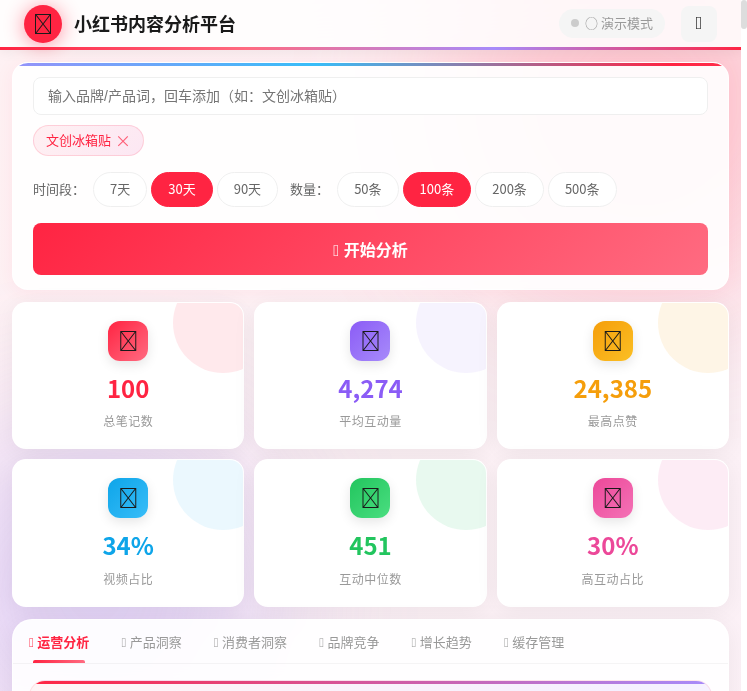
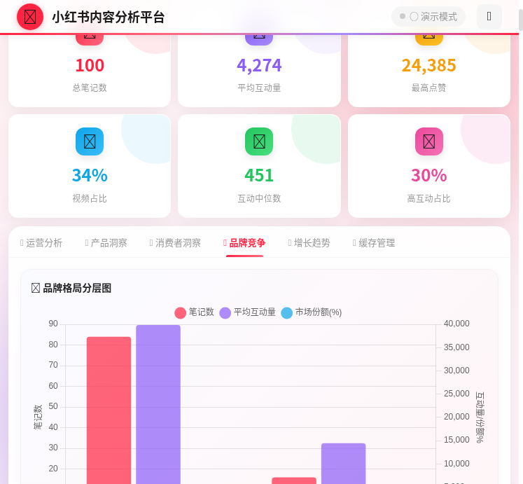
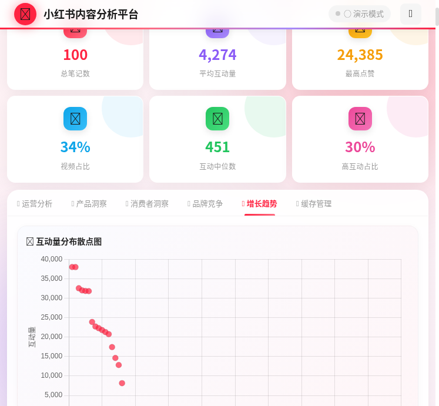
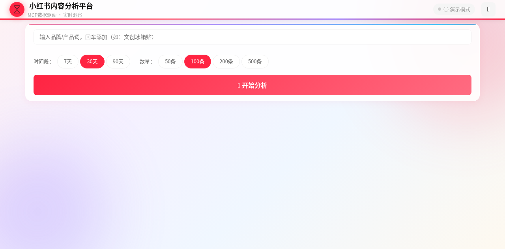

# 🔍 小红书内容智能分析平台

> 一站式小红书内容数据分析工具，支持实时数据爬取、多维度深度分析、智能洞察生成，助力品牌运营决策。





---

## ✨ 功能亮点

- **🚀 MCP 实时数据爬取** — 对接小红书 MCP REST API，支持分页自动爬取，最多获取 500 条笔记
- **📊 6 大分析维度** — 运营分析、产品洞察、消费者洞察、品牌竞争、增长趋势、缓存管理
- **🧠 AI 智能洞察** — 自动生成运营数据总结、品牌竞争分析、增长趋势洞察
- **🏷️ 热门标签词云** — Canvas 螺旋布局词云，直观展示热门话题
- **🏆 品牌竞争格局** — 品牌分层、集中度分析、互动效率气泡图
- **📈 增长趋势分析** — 内容生命周期定位、质量评分分布、互动效率排名
- **📋 多维排序** — 笔记列表支持按点赞/收藏/评论/总互动排序
- **💾 智能缓存** — 24 小时本地缓存，避免重复请求，支持缓存管理
- **📥 多格式导出** — 支持 CSV、JSON、分析报告（TXT）三种导出格式
- **📱 响应式布局** — 自适应横屏/竖屏，大屏展示更多内容
- **🎨 精美 UI** — 毛玻璃效果、渐变色彩、流畅动画

---

## 📸 界面预览

### 🏠 首页



输入关键词，选择时间段和数量，一键开始分析。

### 📊 运营分析


| 模块 | 说明 |
|------|------|
| **运营数据总结** | 综合评级（优秀/良好/一般）+ 6 项核心指标 + 4 维深度分析 |
| **互动率分布** | 7 档互动量区间分布柱状图 |
| **发布时段热力图** | 24 小时互动热度分布，标注最佳发布时段 TOP3 |
| **热门标签词云** | Canvas 螺旋布局，TOP20 标签可视化 |
| **内容类型分布** | 图文 vs 视频占比环形图 |
| **互动趋势分析** | 互动量排序趋势 + 移动平均线 |
| **智能运营洞察** | 发布时机、内容策略、标签使用 3 条 AI 洞察 |

### 🏆 品牌竞争分析


| 模块 | 说明 |
|------|------|
| **品牌格局分层图** | TOP10 / NO.11-20 / NO.21-50 / 其他 四层格局 |
| **品牌集中度分析** | CR3 / CR5 / CR10 集中度指标 |
| **TOP 品牌排行榜** | 排名、笔记数、总互动、平均互动、份额 |
| **品牌互动效率气泡图** | X=笔记数, Y=平均互动, 气泡=总互动 |
| **品牌竞争洞察** | 自动生成竞争格局分析文本 |

### 📊 增长趋势分析


| 模块 | 说明 |
|------|------|
| **互动量分布散点图** | 头部/腰部/长尾内容分区可视化 |
| **内容生命周期定位** | 四象限分析：高热度高产量等 |
| **互动效率 TOP10** | 每字符互动效率排名 |
| **内容质量评分分布** | 0-100 分五维综合评分分布 |
| **增长洞察** | 自动生成增长趋势分析文本 |

### 🎯 产品洞察

| 模块 | 说明 |
|------|------|
| **产品关键词 TOP20** | 高频产品词水平条形图 |
| **互动量热度分布** | 互动量排序曲线 + 头部 10% 标注 |
| **使用场景分析** | 10 大消费场景卡片（礼赠/旅游/DIY 等） |
| **热门概念矩阵** | 限定/联名/定制/限量等概念标签卡片 |
| **产品开发洞察** | 市场评估 + 用户偏好 + 产品建议 |

### 👥 消费者洞察

| 模块 | 说明 |
|------|------|
| **情感分析** | 正面/中性/负面三分类 + 环形图 + 代表性标题 |
| **用户画像** | 内容偏好、互动层次、地域分布 TOP5 |
| **需求词 vs 痛点词** | 双列对比进度条 |
| **互动行为偏好** | 5 维雷达图（点赞率/收藏率/评论率等） |
| **消费决策因素** | 6 维雷达图（品质/价格/品牌/外观/功能/情感） |
| **内容传播力分析** | 收藏转化率 + 评论活跃度对比 |

---

## 🚀 快速开始

### 方式一：直接打开（推荐）

双击 `index.html` 即可在浏览器中使用，无需安装任何依赖。

> MCP 离线时自动切换为演示数据模式，所有分析功能均可正常使用。

### 方式二：本地 HTTP 服务

```bash
# Python
python3 -m http.server 8080

# Node.js
npx serve .

# 然后打开 http://localhost:8080
```

### 方式三：对接 MCP 实时数据

1. 启动小红书 MCP 服务（默认端口 `18060`）
2. 打开页面，点击右上角 ⚙️ 设置
3. 输入 MCP 服务地址（如 `http://localhost:18060`）
4. 点击"测试连接"，显示"已连接"即可

**MCP API 接口规范：**

| 接口 | 方法 | 说明 |
|------|------|------|
| `/health` | GET | 健康检查 |
| `/api/v1/feeds/search` | GET | 搜索笔记 |

**搜索参数：**

| 参数 | 说明 | 可选值 |
|------|------|--------|
| `keyword` | 搜索关键词 | 任意文本 |
| `sort` | 排序方式 | `general`（综合） |
| `filter_duration` | 时间段 | `1`=7天, `2`=30天, `3`=90天 |
| `cursor` | 分页游标 | 上一页返回的 cursor |

**数据路径：** `json.data.feeds` → `item.noteCard.displayTitle` / `item.noteCard.interactInfo.likedCount` 等

---

## 📋 使用指南

### 1. 搜索分析

1. 在搜索框输入关键词（如"文创冰箱贴"），按 **Enter** 添加
2. 支持多关键词（最多 5 个），空格拼接搜索
3. 选择时间段：**7 天 / 30 天 / 90 天**
4. 选择数量：**50 条 / 100 条 / 200 条 / 500 条**
5. 点击 **🔍 开始分析**

### 2. 查看分析结果

- **6 个 Tab** 切换不同分析维度
- 每个维度包含多个图表和洞察
- 点击"📋 复制"可复制洞察文本

### 3. 笔记列表

- 默认按 **点赞量** 降序排列
- 可切换为按 **收藏量 / 评论量 / 总互动** 排序
- 点击笔记卡片弹出 **详情弹窗**，显示：
  - 封面大图 + 完整标题
  - 互动数据（点赞/收藏/评论/总互动）
  - **内容质量评分**（0-100 分圆形进度条）
  - **互动效率** + **收藏转化率**
  - **🔗 在小红书中打开**（跳转真实笔记页面）

### 4. 数据导出

| 格式 | 说明 |
|------|------|
| **📥 CSV** | 结构化表格数据，可用 Excel 打开 |
| **📥 JSON** | 完整 JSON 数据，便于程序处理 |
| **📊 分析报告** | TXT 格式完整报告，含数据概览 + 标签 + 品牌 + 笔记明细 |

### 5. 缓存管理

- 分析结果自动缓存到 `localStorage`（24 小时有效）
- 重复搜索时弹出缓存确认，可选择直接使用或重新爬取
- 在"💾 缓存管理"Tab 中查看/使用/删除缓存

---

## 🧮 内容质量评分算法

笔记详情弹窗中的质量评分（0-100 分）基于 5 个维度：

| 维度 | 权重 | 计算方式 |
|------|------|---------|
| **互动百分位** | 30 分 | 总互动量在所有笔记中的百分位排名 |
| **收藏转化率** | 25 分 | 收藏数/点赞数比率（越高说明内容越有收藏价值） |
| **评论活跃度** | 20 分 | 评论数/点赞数比率（越高说明讨论度越高） |
| **标题质量** | 15 分 | 标题长度 15-30 字最优，含标签加分 |
| **内容丰富度** | 10 分 | 视频类型加分，标题较长加分 |

---

## 🛠 技术栈

| 技术 | 用途 |
|------|------|
| **HTML5 / CSS3** | 页面结构与样式 |
| **JavaScript (ES6+)** | 业务逻辑 |
| **Chart.js 4.4.0** | 图表渲染（柱状图/折线图/饼图/雷达图/气泡图/散点图） |
| **Canvas API** | 词云绘制（螺旋布局算法） |
| **localStorage** | 数据缓存 |
| **Fetch API** | MCP REST API 调用 |
| **Blob API** | 文件导出下载 |

---

## 📁 项目结构

```
xhs-analysis/
├── index.html          # 单文件应用（全部代码）
├── docs/               # 文档资源
│   ├── homepage.png            # 首页截图
│   ├── operation-analysis.png  # 运营分析截图
│   ├── brand-competition.png   # 品牌竞争截图
│   └── growth-trend.png        # 增长趋势截图
└── README.md           # 项目说明文档
```

---

## 📊 分析维度体系

本平台的分析框架参考专业消费洞察白皮书（魔镜洞察 2025 年消费新潜力白皮书）设计，涵盖以下维度：

```
├── 📊 运营分析
│   ├── 运营数据总结（综合评级 + 6 项指标 + 4 维分析）
│   ├── 互动率分布（7 档区间）
│   ├── 发布时段热力图（24 小时）
│   ├── 热门标签词云（TOP20）
│   ├── 内容类型分布（图文/视频）
│   ├── 互动趋势分析（移动平均线）
│   └── 智能运营洞察（AI 生成）
│
├── 🎯 产品洞察
│   ├── 产品关键词 TOP20
│   ├── 互动量热度分布
│   ├── 使用场景分析（10 大场景）
│   ├── 热门概念矩阵（限定/联名/定制等）
│   └── 产品开发洞察
│
├── 👥 消费者洞察
│   ├── 情感分析（正面/中性/负面）
│   ├── 用户画像（偏好/互动层次/地域）
│   ├── 需求词 vs 痛点词
│   ├── 互动行为偏好（5 维雷达图）
│   ├── 消费决策因素（6 维雷达图）
│   └── 内容传播力分析
│
├── 🏆 品牌竞争分析
│   ├── 品牌格局分层（TOP10/11-20/21-50/其他）
│   ├── 品牌集中度（CR3/CR5/CR10）
│   ├── TOP 品牌排行榜
│   ├── 品牌互动效率气泡图
│   └── 品牌竞争洞察
│
├── 📊 增长趋势分析
│   ├── 互动量分布散点图（头部/腰部/长尾）
│   ├── 内容生命周期定位（四象限）
│   ├── 互动效率 TOP10
│   ├── 内容质量评分分布
│   └── 增长洞察
│
└── 💾 缓存管理
    ├── 缓存列表（关键词/时间/数量）
    ├── 使用/删除缓存
    └── 清空全部缓存
```

---

## ⚙️ 配置说明

### MCP 服务配置

| 配置项 | 默认值 | 说明 |
|--------|--------|------|
| MCP 地址 | `http://localhost:18060` | MCP REST API 地址 |
| 请求超时 | 60 秒 | 单次 API 请求超时时间 |
| 缓存有效期 | 24 小时 | localStorage 缓存过期时间 |
| 最大关键词数 | 5 个 | 单次搜索最多关键词数 |
| 最大爬取数量 | 500 条 | 单次搜索最大笔记数 |

### 筛选器参数

| 时间段 | filter_duration | 说明 |
|--------|----------------|------|
| 7 天 | `1` | 近一周数据 |
| 30 天 | `2` | 近一月数据（默认） |
| 90 天 | `3` | 近三月数据 |

---

## 📝 更新日志

### v1.0.0 (2025-04)

- ✅ 6 大分析 Tab 完整实现
- ✅ MCP REST API 对接 + 分页爬取
- ✅ 演示数据自动降级
- ✅ 运营数据深度总结（综合评级系统）
- ✅ 品牌竞争格局分析（分层 + 集中度 + 气泡图）
- ✅ 增长趋势分析（散点图 + 生命周期 + 质量评分）
- ✅ 内容质量评分算法（5 维度 0-100 分）
- ✅ 笔记列表多维排序
- ✅ 数据去重（按 ID 自动过滤）
- ✅ 三种格式导出（CSV / JSON / 分析报告）
- ✅ 24 小时智能缓存
- ✅ 响应式布局（横屏/竖屏自适应）
- ✅ 精美 UI（毛玻璃 + 渐变 + 动画）

---

## 📄 License

MIT License

---

## 🤝 贡献

欢迎提交 Issue 和 Pull Request！

1. Fork 本仓库
2. 创建特性分支 (`git checkout -b feature/amazing-feature`)
3. 提交更改 (`git commit -m 'Add some amazing feature'`)
4. 推送到分支 (`git push origin feature/amazing-feature`)
5. 发起 Pull Request
